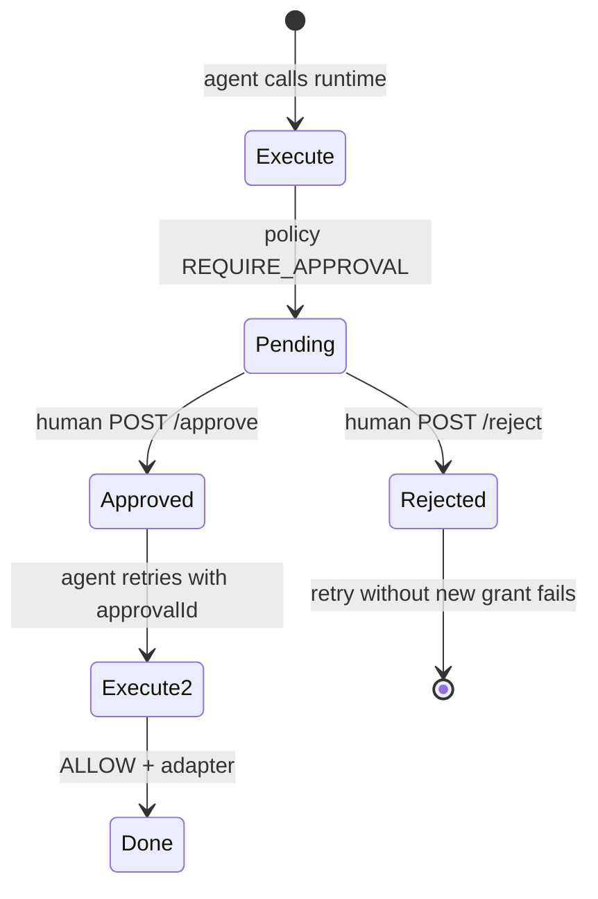

# Approvals — how resumption, expiry, and identity work

Human-in-the-loop gates are a first-class runtime decision (`REQUIRE_APPROVAL`), not an afterthought.

---

## Lifecycle



1. Policy returns `REQUIRE_APPROVAL` → runtime creates `approvalId` (`appr_<uuid>`).
2. Audit event records `decision: REQUIRE_APPROVAL` with reason.
3. Human approves or rejects out-of-band (API, UI, ticket system).
4. Agent **must** retry with the **same** `token`, `tool`, `payload`, and `approvalId`.

---

## Binding rules (anti-tampering)

An approval is valid only if **all** match:

| Field | Must match execute request |
|-------|----------------------------|
| Capability JWT | Exact same token string |
| `tool` | Same tool id |
| `payload` | Deep equality (recipient, amount, etc.) |

If the agent changes the recipient after approval → **DENY** (“approval does not match”).

Rejected approvals (`POST /approvals/:id/reject`) **cannot** be resumed.

---

## Approver identity

| Mechanism | v1 behavior |
|-----------|-------------|
| Who can approve? | Any caller with access to approval API (gateway: open by default in dev) |
| `resolvedBy` | Optional string on approve/reject — stored for audit, **not** cryptographically bound |
| Production | Protect `/approvals/*` with your IdP, service account, or admin API key pattern |

RFC-0005 admin auth covers **grant/delegate/revoke**, not approval endpoints today — deployers should place approvals behind internal network or add gateway middleware.

---

## Expiry

| Artifact | Expiry |
|----------|--------|
| Capability JWT | `exp` claim (default 15m, max 24h) |
| Approval request | **No separate TTL in v1** — tied to capability lifetime |
| Pending approval after token expires | Execute fails at validation (`EXPIRED`) before approval is checked |

**Recommendation:** Use short capability TTL for high-risk flows; reject stale approvals when token is near expiry.

---

## Resuming execution

```typescript
const pending = await client.execute({ token, tool: "gmail.send", payload });

if (!pending.ok && pending.decision === "REQUIRE_APPROVAL") {
  await client.approve(pending.approvalId!, "manager@company.com");

  const done = await client.execute({
    token,           // same
    tool: "gmail.send",
    payload,         // same
    approvalId: pending.approvalId,
  });
}
```

Policy evaluation sets `approvalGranted: true` internally — external-domain rules that normally require approval will pass.

---

## Audit correlation

- `REQUIRE_APPROVAL` audit event → note `auditId`
- Approval record stores reference to token `jti`, tool, payload hash
- Successful resume → `ALLOW` audit should include same `approvalId`

Query: `GET /audit?decision=REQUIRE_APPROVAL` then trace by `approvalId`.

---

## Related

- [audit-and-approvals.md](./audit-and-approvals.md)
- [RFC-0002 §8](./rfc/RFC-0002-runtime-execution.md)
- [threat-stories.md](./threat-stories.md) (Story 2)
