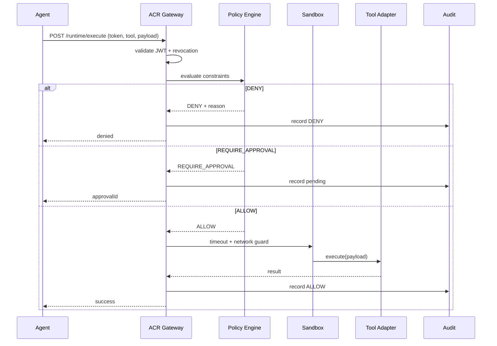
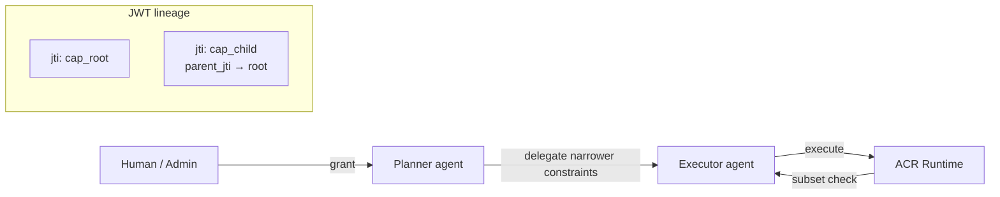
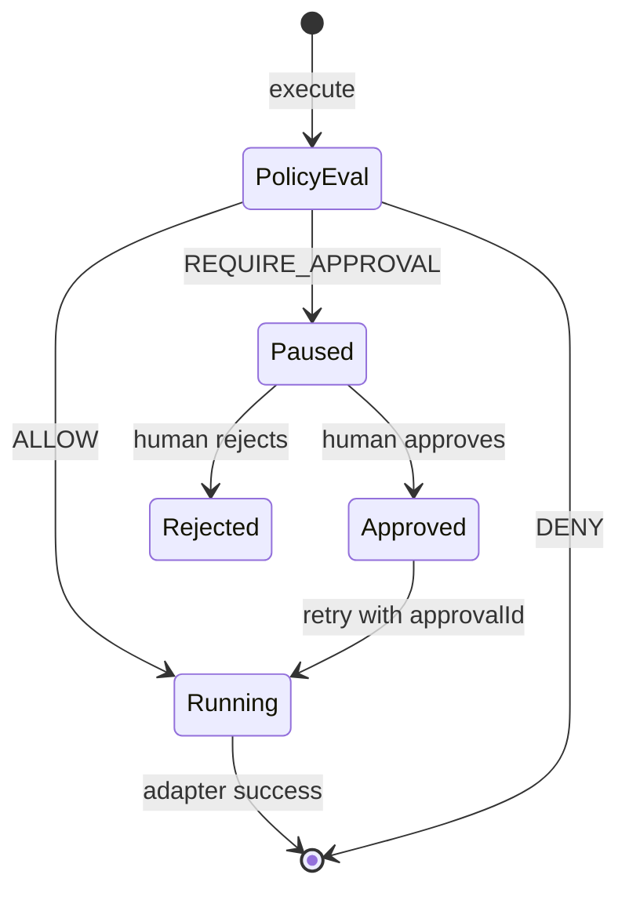

# Architecture diagrams

Visual reference for runtime flow, delegation, interception, and approvals.

## Runtime execute flow



## Capability grant vs execute

```
  GRANT (admin)                         EXECUTE (agent)
       │                                      │
       ▼                                      ▼
  ┌─────────┐    signed JWT            ┌──────────────┐
  │ Issuer  │ ───────────────────────► │   Runtime    │
  │         │   tool + constraints     │  validates   │
  └─────────┘   max_actions, domains   │  + policy    │
                                         │  + sandbox   │
                                         └──────┬───────┘
                                                │
                    ┌───────────────────────────┼───────────────────────────┐
                    ▼                           ▼                           ▼
                 ALLOW                      DENY                   REQUIRE_APPROVAL
              (adapter runs)            (blocked + audit)         (human approves, retry)
```

## Delegation chain



Child tokens **cannot exceed** parent constraints (domain subset, lower `maxActions`, etc.).

## Approval workflow



## Revocation (multi-instance)

```
  Admin ──POST /capabilities/revoke──► Revocation store
                                              │
                    ┌─────────────────────────┴─────────────────────────┐
                    │  memory (default)  OR  Redis (ACR_REVOCATION_MODE) │
                    └─────────────────────────┬─────────────────────────┘
                                              │
  Agent execute ──► isRevoked(jti)? ──yes──► DENY token_revoked
```

## Related docs

- [RFC-0002 Runtime Execution](./rfc/RFC-0002-runtime-execution.md)
- [execution-state-machine.md](./execution-state-machine.md)
- [CONCEPTS.md](./CONCEPTS.md)
